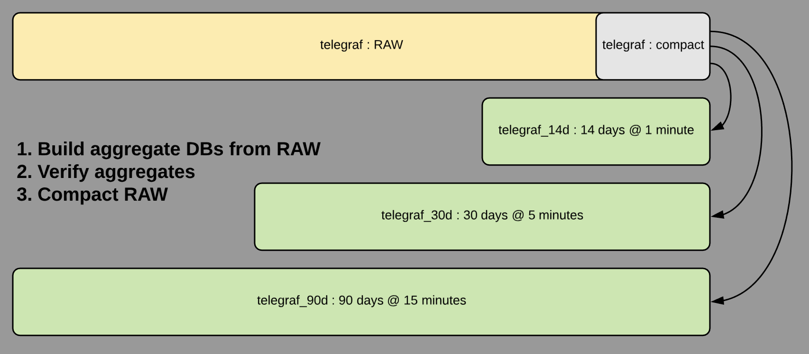
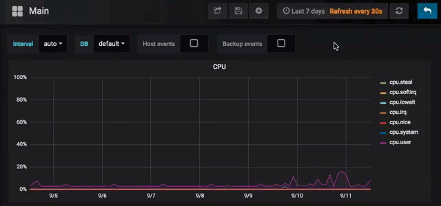
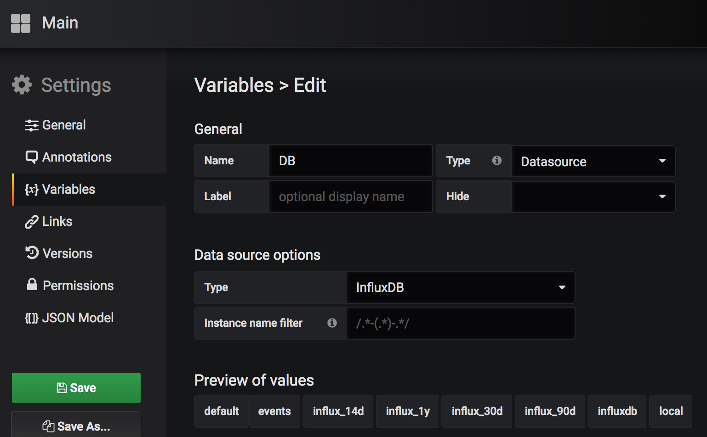

[](https://travis-ci.org/DrPsychick/ansible_influx_downsampling)

Configure influxDB for downsampling
===================================

Motivation:
-----------
InfluxDB uses a default retention policy that keeps data **forever** in 7 day shards - in RAW format (data points every 10 or 30 seconds, depending on your input configuration).
Of course this is a good default, but once you have old data and want to introduce downsampling without loosing data, its a **lot** of manual work to setup all the queries etc.

So ... I have done this for you!

Two usage scenarios:
* You already have an influxdb running and it's getting BIG, so you want to introduce downsampling on-the-fly to make things faster and cheaper
* You intend to use influxdb and want to set it up with downsampling in mind (so it does not grow big over time in the first place)

Honestly the two use cases are not much different. The biggest difference is the time it takes to run through the playbook when you enable backfilling. Of course, if you work on existing data, don't forget to **have a proper backup!**

Demo
----



How it works:


This requires to setup a "database" variable, like so:



Preparation
-----------
As preparation you don't need much, except knowing how exactly you want to downsample your data as you need to setup your configuration first.
Once configured, you can run each level separately and/or repeatedly without any issue as the role only creates/adds what is missing (ok, CQs are always recreated as there is no way to alter them). This way you can iterate your way towards a final setup and add compaction as last step, once you're happy with the result.

Setup
-----

Easiest setup is create a role in your own repository and adding this:
* Decide on the name of the setup, let's call the role "influx-setup" and the setup "frank"
* *hint* you can have any number of setups configured in this role. You just always have to load first **your** role (defining the setup) and then **DrPsychick.ansible_influx_downsampling** for each setup.

`roles/influx-setup/tasks/main.yml`
```
- name: "Include definition from influxdb_{{vars_name}}.yml"
  include_vars: influxdb_{{vars_name}}.yml
    when: vars_name is defined

# you can add your own tasks here that will be executed prior to `ansible_influx_downsampling` role
```

`roles/influx-setup/vars/influxdb_frank.yml`
--> take one from the examples directory as a base for your own: [examples/](examples/)

Now in your playbook, include both roles:
`influx-setup.yml`
```
- name: InfluxDB 
  hosts: localhost
  roles: 
    - { role: influx-setup, vars_name: "frank" }
    - { role: DrPsychick.ansible_influxdb_downsampling}
```

Configuration
-------------

Now the most tricky part. You need to know what aggregation levels you want and define them. Moreover, especially if you don't use standard telegraf plugins for input, you need to **define the aggregation queries for your measurements**.

InfluxDB has this awesome feature to do dynamic aggregation (`SELECT MEAN(*) FROM :MEASUREMENT GROUP BY *`), **but** it automatically prepends `mean_` to every field in the measurement and this would mean, you **cannot reuse the dashboard you use on your RAW data**.

The solution is simple, but requires work. You have to name your columns individually as the original column, idependent of the aggregation method you use.

Example:
```
SELECT MEAN(usage_user) FROM cpu; # on RAW
SELECT MEAN(usage_user) AS usage_user INTO telegraf_14d.rp_14d.cpu FROM cpu; # in aggregate queries
```

The good thing about defining the aggregation method individually is that you can mix it and choose what is best for the individual column. And once it's defined, it can be reused for all aggregation levels.
Additionally you can choose to add more aggregations (min, mean and max) and have a dashboard which includes them.

```
SELECT LAST(string_value) AS string_value # for strings
SELECT MAX(users) AS users # for metrics where you're interested in the MAX
...
```

The configuration goes into your `vars` file or you can choose to setup global vars for it.
If you use generic input plugins from telegraf or other typical sources, **please add them to `defaults/main.yml` and send me a pull request**, so others can profit from them too.

Query definition or override:
```
my_ansible_influx_queries:
  # override default settings, use german performance counter names
  win_cpu: >
    SELECT mean("Benutzerzeit_(Percent)") AS "Benutzerzeit_(Percent)"
    , mean("DPC-Zeit_(Percent)") AS "DPC-Zeit_(Percent)"
    , mean("Interruptzeit_(Percent)") AS "Interruptzeit_(Percent)"
    , mean("Leerlaufzeit_(Percent)") AS "Leerlaufzeit_(Percent)"
    , mean("Privilegierte_Zeit_(Percent)") AS "Privilegierte_Zeit_(Percent)"
    , mean("Prozessorzeit_(Percent)") AS "Prozessorzeit_(Percent)"
```

A complete setup can be found in [examples/full-5level-backfill-compact/](examples/full-5level-backfill-compact/)

Attention
=========
If you enable **backfill**:
* Check the size of your data first. Depending on the amount of series in a measurement, you need to configure the time range for backfilling. A good default is "1d" - but you may not want to run 365 queries for a year...
* Timeouts: Your InfluxDB as well as the calls in this playbook may time out! Or you may hit other limits in the influxdb.conf.
* Stats: They will **likely** crash because they query big time ranges with lots of data. Only turn them on for small backfill jobs.

If you enable **backfill and compact**:
* After a complete run with compaction you need to check and recreate all continuous queries based on the new default RP of the source.
* Better: specify ".." as source to always use the default (see TODOs)

Results of my full setup can be found in [examples/full-5level-backfill-compact/](examples/full-5level-backfill-compact/)

Use Cases
=========

* Just setup default RETENTION POLICY: [examples/basic.yml](examples/basic.yml)
* Clone RAW data into new RETENTION POLICY and drop old data: [examples/compact.yml](examples/compact.yml)
* Full 5 level downsampling including compaction: [examples/full-5level-backfill-compact/](examples/full-5level-backfill-compact/)

History
=======

Future Version:
* [i] refactor/cleanup variables + introduce "mode" = setup, migrate, compact with separate task files
* [ ] add changed_when conditions (e.g. drop+create CQ should be "changed")
* [ ] add RP shard duration option
* [ ] shift CQs by "spread" seconds: 60+/-5sec EVERY 5m+-1s,2s,3s,... + step in seconds

Version 0.3: Complete incl. automatic compaction, tests and good examples.

* [x] multiple/full examples -> see examples/
* [x] more tests:
   * [x] run backfill without CQ during operation and switch RP
   * [x] setup with 2 levels and CQ
   * [x] recreate CQs
   * [x] CQs on empty (default) RP of source (sourcedb..measurement)
   * [x] Merge recreate with migrate TEST, fix recreate CQs!
* [x] howto switch retention policy (cleanup after all is setup)
   * [x] Case: copy from "autogen", no CQ, drop source after backfill + set default RP -> see test
* [x] implement "offset" for CQs, it shifts time!
* [x] backfill gap twice or until it is below x=1 minute (to keep gap as small as possible)

Version 0.2: Fully working and tested. No deleting of data. Stats + CQ update.

* [x] Update description + basic readme
* [x] Check variables upfront (define clear dependencies) and print useful error messages before acting
* [x] fix: continuous_query is required even if empty (bad usability)
* [x] more tests: 
   * [x] test parallel tests
   * [x] prepare seeding (generator or file?)
   * [x] run downsampling + backfill on existing DB (needs seed)
   * [x] run backfill with step X (on RP with 7d)
* [x] set RP default yes/no
* [x] improve/extend dict structure (BC break!)
* [x] update continuous queries (drop+create)
* [x] stats (total data points written per DB / average downsampling ratio)
* [x] support selective group by in backfill and continuous query

Version 0.1:

* basic functionality
* create databases + retention policy
* backfill measurements
* create continuous queries
