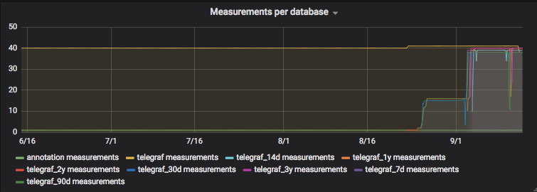

Full five level downsampling including backfill and compaction
==============================================================

My setup
--------

5 Levels of aggretation:
* 14 days : 1 minute granularity
* 30 days : 5 minutes granularity
* 90 days : 15 minutes granularity
* 1 year  : 1 hour granularity
* 3 years : 3 hour granularity

My "telegraf" database holds about 1 year of RAW data (every 10s), fed from around 10 machines and about 10 docker containers. The measurements I have in use can be seen in the example config.

The continuous queries are all based on the RAW source. You could theoretically each base them on the previous aggregate, which would then calculate MEANs of MEANs, but would be faster/more efficient.

Disk space before migrate + compact
```
162M	/var/lib/docker/volumes/monitoring_influxdb/_data/data/_internal
9.6G	/var/lib/docker/volumes/monitoring_influxdb/_data/data/telegraf
```

After completion
----------------

90 days trend:


![Series](Series.png "Series"

Disk space after migrate + compact
```
188M	/var/lib/docker/volumes/monitoring_influxdb/_data/data/_internal
57M	/var/lib/docker/volumes/monitoring_influxdb/_data/data/telegraf_3y
116M	/var/lib/docker/volumes/monitoring_influxdb/_data/data/telegraf_90d
85M	/var/lib/docker/volumes/monitoring_influxdb/_data/data/telegraf_1y
107M	/var/lib/docker/volumes/monitoring_influxdb/_data/data/telegraf_14d
74M	/var/lib/docker/volumes/monitoring_influxdb/_data/data/telegraf_30d
363M	/var/lib/docker/volumes/monitoring_influxdb/_data/data/telegraf
```

Helpful commands to fill gaps:
------------------------------

1 Run the playbook once again, to recreate CQs which logs queries in influxDB log

2 Take all CQ queries from the log 
  `docker logs -f monitoring_influxdb_1 2>&1 | grep '2018-09-12T18' |grep 'CREATE CONTINUOUS QUERY .*INTO' cq.log`

Alternative:
1 query continuous queries 
2 transform them with `jq` or another tool to pure query strings

3 Transform logs to queries
```
grep rp_7d cq.log |sed -e 's/.*BEGIN \(.*\)GROUP BY\(.*\) END"$/\1AND time >= 1536674400000ms GROUP BY\2/' | 
  sed -e 's#^\(.*\)$#curl -s http://localhost:8086/query --data-urlencode "q=\1"#' |sort |uniq > queries.log
```

4 Execute queries
```
IFS="
"; for cmd in $(cat queries.log); do eval $cmd; done
```

