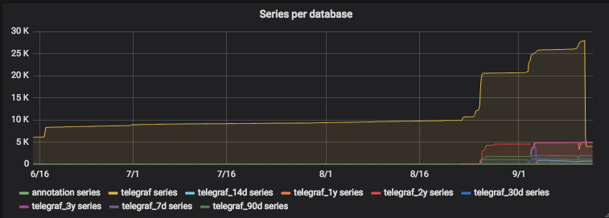

Full five level downsampling including backfill and compaction
==============================================================

My setup
--------

My "telegraf" database has about 9GB size on disk, holds about 1 year of RAW data (every 10s), fed from around 10 machines and about 10 docker containers. The measurements I have in use can be seen in the example config.

The continuous queries are all based on the RAW source. You could theoretically each base them on the previous aggregate, which would then calculate MEANs of MEANs, but would be faster/more efficient.

Disk space before migrate + compact
```
162M	/var/lib/docker/volumes/monitoring_influxdb/_data/data/_internal
9.6G	/var/lib/docker/volumes/monitoring_influxdb/_data/data/telegraf
```

Configuration
-------------

My Settings for **backfilling 9GB of data on 5 aggregation levels** on a docker container with 3GB of RAM (no CPU limit for backfilling)
* `ansible_influx_databases`, 5 levels of aggregation
  * 14 days : 1 minute granularity
  * 30 days : 5 minutes granularity
  * 90 days : 15 minutes granularity
  * 1 year  : 1 hour granularity
  * 3 years : 3 hours granularity
* `ansible_influx_timeout`: 600 (10 minutes)
* influxdb.conf: 
  * `query-timeout="600s"`
  * `max-select-point=300000000`
  * `max-select-series=1000000`
  * `log-queries-after="10s"`

Running the playbook
--------------------

* backfill duration: 
  * 14 days :  42 minutes
  * 30 days :  38 minutes
  * 90 days :  80 minutes
  *  1 year : 120 minutes
  *  3 years: 170 minutes
  * compact 7d: 42 minutes (switch source RP to 7d (compact))
  * **total**: 492 m ~8.5 hours
* Result
  * Series dropped from ~28k to 4k after compaction of source (9.6GB to 400MB)
  * `docker_container_blkio` takes the longest, maybe because of my multi-element where clause "/^(a|b|c|...)$/" and tons of generated container_names in the DB...
  * `influxdb_shard` had many data-points (had to increase influxdb.conf setting)
  * A small gap between backfilling and retention policy switch during compact

After completion
----------------

90 days trend:



Disk space after migrate + compact
```
188M	/var/lib/docker/volumes/monitoring_influxdb/_data/data/_internal
57M	/var/lib/docker/volumes/monitoring_influxdb/_data/data/telegraf_3y
116M	/var/lib/docker/volumes/monitoring_influxdb/_data/data/telegraf_90d
85M	/var/lib/docker/volumes/monitoring_influxdb/_data/data/telegraf_1y
107M	/var/lib/docker/volumes/monitoring_influxdb/_data/data/telegraf_14d
74M	/var/lib/docker/volumes/monitoring_influxdb/_data/data/telegraf_30d
363M	/var/lib/docker/volumes/monitoring_influxdb/_data/data/telegraf
```

Helpful commands to fill gaps:
------------------------------

Alternative to doing this manually, is createing a similar setup that (force) backfills aggregates of the last 7 days.

Define timestamp for backfill (Make sure its UTC!):
`ts_backfill=$(date -d "2018-09-12 16:00" +%s)000ms`

Simple:
1. Run the playbook once again, to recreate CQs which logs queries in influxDB log
2. Take all CQ queries from the log
```
docker logs monitoring_influxdb_1 2>&1 | grep '2018-09-12T18.*CREATE CONTINUOUS QUERY .*INTO' |
  sed -e 's/.*\(CREATE CONTINUOUS QUERY.*END\)/\1/' > cq.log
```

Alternative:
1. query continuous queries
2. transform them with `jq` or another tool to pure query strings
```
curl -s -X POST http://localhost:8086/query --data-urlencode "q=SHOW CONTINUOUS QUERIES" | 
  jq .results[].series[3,4,5,6,7].values[][1] > cq.log
```

3. Transform logs to queries
```
grep rp_7d cq.log |
  sed -e 's/.*BEGIN \(.*\)GROUP BY\(.*\) END"$/\1AND time >= '$ts_backfill' GROUP BY\2/' |
  sed -e 's#^\(.*\)$#curl -s -X POST http://localhost:8086/query --data-urlencode "q=\1"#' > queries.log
```

4. Execute queries
```
IFS="
"; for cmd in $(cat queries.log); do eval $cmd; done
```

